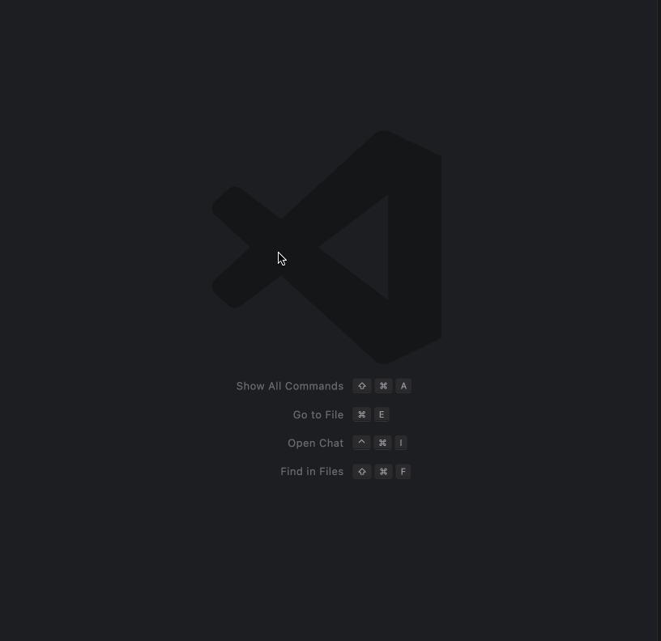

# Scratchy

**Scratchy** is a lightweight VS Code extension that allows you to quickly create and open temporary scratch files in different programming languages.

## Features

- Choose from popular file types: JavaScript, TypeScript, Python, Markdown, JSON
- Automatically names files using a persistent counter (e.g., `scratch_1.ts`, `scratch_2.md`, etc.)
- Sets the correct language mode for each created file
- Stores files in the OS temp directory
- Quick pick menu to select file type

## Usage

1. Use the keyboard shortcut **Ctrl+Cmd+N** (or open the command palette with ⇧⌘P or Ctrl+Shift+P and run `Scratchy: Create Scratch File`)
2. Select a language
3. A new untitled file will open with the appropriate extension and language mode



## Extension Settings

Currently, there are no configurable settings.

## Requirements

None.

## Development

- Run `npm install`
- Use `F5` to launch a development instance of VS Code

## Testing

Tests are written using `vscode-test`. Run them with:

```bash
npm test
```

## License

MIT